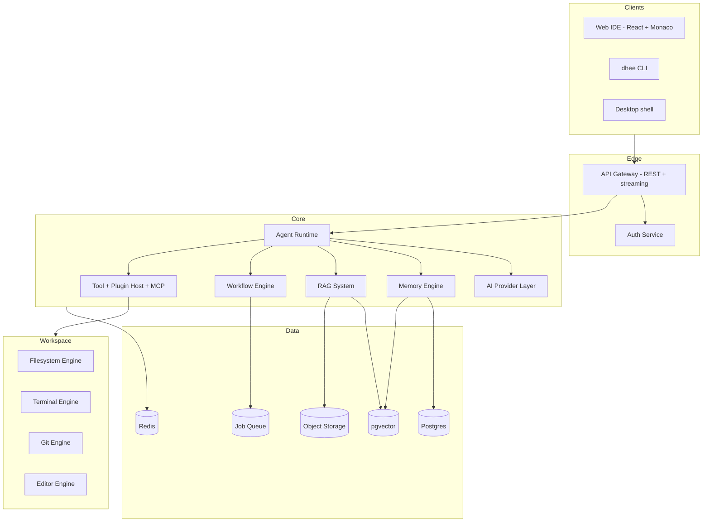

# Architecture

```
Status: Stable
Priority: High
Owner: Repository Maintainer
Depends On: ENGINEERING_CONSTITUTION.md, PRINCIPLES.md, MASTER_PRD.md
Related Documents: TECH_STACK.md, MONOREPO_STRUCTURE.md, API_SPEC.md, AI_PROVIDER_LAYER.md, AGENT_RUNTIME.md, MEMORY_ENGINE.md, RAG_SYSTEM.md, SECURITY_MODEL.md
Next Expansion: Add sequence diagrams for a full agent run and a RAG-augmented chat turn.
Last Updated: 2026-07-23
```

This document defines the high-level architecture of Dhee_AI. It is second only to the
Constitution in precedence. All implementation must comply with the boundaries and rules here.

## 1. Architectural goals
Modularity, extensibility, provider independence, security by default, and a 10+ year
maintainability horizon (see [`PRINCIPLES.md`](PRINCIPLES.md)). Every subsystem is a replaceable
module with an explicit, typed contract.

## 2. System overview



## 3. Layers
- **Clients** — web IDE (React + Monaco), CLI, and desktop shell; all talk to the backend via
  the same public API ([`API_SPEC.md`](API_SPEC.md)).
- **Edge** — API gateway (REST + streaming) and authentication/authorization
  ([`AUTH_SYSTEM.md`](AUTH_SYSTEM.md)).
- **Core services** — the AI brain: agent runtime, provider layer, memory, RAG, workflow engine,
  and the tool/plugin/MCP host.
- **Workspace services** — filesystem, terminal, git, and editor engines that operate on user
  projects under strict sandboxing ([`SECURITY_MODEL.md`](SECURITY_MODEL.md)).
- **Data** — Postgres (+ pgvector), Redis cache, a job queue, and object storage.

## 4. Module boundaries & dependency rules
- Dependencies flow **inward and downward**: clients -> gateway -> core -> data. Workspace
  services are invoked through the tool host, never directly by clients.
- **No cyclic dependencies.** Shared contracts live in `packages/*`; apps depend on packages,
  never the reverse (see [`MONOREPO_STRUCTURE.md`](MONOREPO_STRUCTURE.md)).
- Every cross-module interaction goes through a **typed interface** (API First, Explicit Over
  Implicit). Modules expose capabilities; they do not reach into each other's internals.
- The **AI Provider Layer** is the only component that talks to external model vendors
  (Zero Vendor Lock-In).
- All side-effecting workspace actions pass through **Human Override** checkpoints.

## 5. Core request flows (summary)
- **Chat turn:** client -> gateway/auth -> agent runtime -> (RAG retrieval + memory) ->
  provider layer -> streamed response -> memory write.
- **Agent run:** planner decomposes a goal -> specialized agents execute steps via tools ->
  results verified against the spec -> Human Override before side effects -> audit log.
- **Workflow:** trigger (event/schedule) -> workflow engine -> queued jobs -> agents/tools ->
  results persisted.

## 6. Cross-cutting concerns
- **Security:** authN/authZ, RBAC, sandboxing, least privilege ([`SECURITY_MODEL.md`](SECURITY_MODEL.md)).
- **Errors:** normalized model ([`ERROR_STANDARDS.md`](ERROR_STANDARDS.md)).
- **Observability:** tracing, metrics, structured logs, audit ([`OBSERVABILITY.md`](OBSERVABILITY.md)).
- **Config:** typed, validated configuration; secrets via environment/secret manager.
- **Naming:** [`NAMING.md`](NAMING.md) applies to every identifier and contract.

## 7. Scalability plan
- Stateless core services scale horizontally behind the gateway; state lives in Postgres,
  Redis, the queue, and object storage.
- Heavy/long-running work (agent runs, indexing, workflows) is offloaded to background workers
  via the queue.
- Vector search scales via pgvector initially, with a defined path to a dedicated vector store
  if needed (to be recorded as an ADR in [`DECISIONS.md`](DECISIONS.md)).
- Caching and token optimization reduce provider cost and latency.

## 8. Compliance with the Constitution
Any change to this architecture requires an ADR ([`DECISIONS.md`](DECISIONS.md)) and updates to
affected diagrams, [`ROADMAP.md`](ROADMAP.md), and [`FEATURE_MATRIX.md`](FEATURE_MATRIX.md), per
the Repository Evolution rules. Implementation must never precede these updates.
