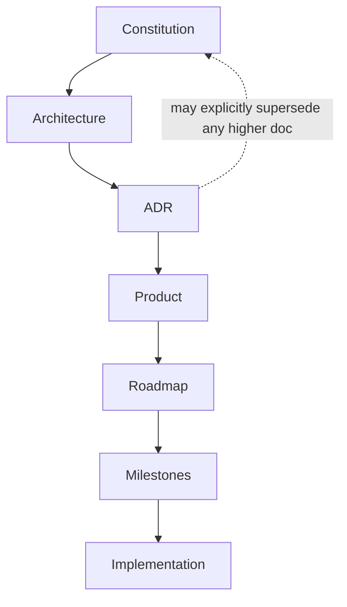

# Dhee_AI Engineering Constitution

```
Status: Stable
Priority: High
Owner: Repository Maintainer
Depends On: -
Related Documents: PRINCIPLES.md, DECISIONS.md, ARCHITECTURE.md, CLAUDE.md, CURSOR_RULES.md, CONTRIBUTING.md
Next Expansion: Ratify amendment process once the first external maintainers join.
Last Updated: 2026-07-23
```

> This is the **supreme document** of the Dhee_AI repository. Every other specification,
> architecture decision, engineering principle, coding standard, roadmap, milestone,
> governance document, and future implementation derives its authority from this file.
> No document and no code may knowingly contradict this Constitution.

---

## 1. Purpose

This repository is not documentation *about* the software. **This repository IS the
software's engineering constitution.** It is the single source of truth from which all
implementation flows.

Dhee_AI is intended to become a leading open-source **AI Operating System**, designed for a
development horizon of **10+ years**. This document exists so that any contributor — human or
AI (Cursor, Claude Code, Codex, GitHub Copilot, or any future agent) — can act autonomously
while remaining perfectly aligned with the project's architecture, principles, and goals.

---

## 2. Document precedence (conflict resolution order)

When two documents or a document and an implementation conflict, the higher-ranked source
wins. **Earlier documents always take precedence unless an Architecture Decision Record in
[`DECISIONS.md`](DECISIONS.md) explicitly supersedes them.**

1. **Engineering Constitution** (this document)
2. **Architecture** ([`ARCHITECTURE.md`](ARCHITECTURE.md))
3. **ADR Decisions** ([`DECISIONS.md`](DECISIONS.md))
4. **Product Requirements** ([`MASTER_PRD.md`](MASTER_PRD.md), [`FEATURE_MATRIX.md`](FEATURE_MATRIX.md))
5. **Roadmap** ([`ROADMAP.md`](ROADMAP.md))
6. **Milestones** ([`milestones/`](milestones/README.md))
7. **Implementation** (source code under `apps/` and `packages/`)



An ADR is the **only** mechanism by which a lower layer may override a higher one, and it must
say so explicitly, with rationale and consequences.

---

## 3. Standard document status header

Every document in this repository begins with the following header block. There are **no
`TODO` markers anywhere** in the specification; the state of a document is expressed only
through `Status` and `Next Expansion`, so coding agents never mistake a specification gap for
implementation work.

```md
Status: Draft | In Review | Stable
Priority: High | Medium | Low
Owner: Repository Maintainer
Depends On:
Related Documents:
Next Expansion:
Last Updated: YYYY-MM-DD
```

- **Status** — `Draft` (being written), `In Review` (complete, under validation), `Stable`
  (ratified and binding).
- **Depends On / Related Documents** — cross-references that keep the specification internally
  consistent.
- **Next Expansion** — the next planned deepening of this document. This is a *specification*
  intent, never an implementation task.

---

## 4. Engineering principles

The constitutional philosophy of Dhee_AI is defined in [`PRINCIPLES.md`](PRINCIPLES.md) and is
binding. In summary: AI First, Human Override, Open Source First, Secure by Default, Privacy by
Design, Modular Architecture, Extensibility Before Convenience, Zero Vendor Lock-In, Backward
Compatibility, Test Before Merge, Documentation Equals Code, API First, Performance Conscious,
Accessibility First, Simplicity Over Complexity, Explicit Over Implicit, Community Driven.

---

## 5. Autonomous engineering workflow (never skipped)

Before making any change, every agent and contributor performs these steps in order:

1. **Read** every relevant specification.
2. **Build** an implementation plan.
3. **Verify** dependencies.
4. **Check** architecture boundaries.
5. **Validate** against engineering principles.
6. **Generate** implementation.
7. **Generate** tests.
8. **Generate** documentation.
9. **Self-review.**
10. **Verify** nothing violates the Constitution.

No step may be skipped. Skipping a step produces an incomplete change.

---

## 6. Repository quality gates

Every pull request, commit, milestone, feature, package, API, plugin, SDK, database
migration, workflow, or AI capability must satisfy **all** of the following. If any gate
fails, the work is considered incomplete.

- [ ] Architecture compliant
- [ ] Constitution compliant
- [ ] Documentation complete
- [ ] Tests included
- [ ] Type safe
- [ ] Performance conscious
- [ ] Secure by default
- [ ] Accessibility compliant
- [ ] Contributor friendly
- [ ] Production ready

---

## 7. Definition of Done

No feature is complete unless:

- Specification updated.
- ADR added when required.
- Documentation complete.
- Tests passing.
- API documented.
- Security reviewed.
- Performance evaluated.
- Accessibility reviewed.
- Examples included where appropriate.
- Backward compatibility verified.
- CI passes successfully.

Only then may a feature be considered complete.

---

## 8. AI development philosophy

All AI coding agents participating in this repository must behave as **senior software
architects**, not code generators. They are expected to:

- Challenge poor architectural decisions.
- Detect inconsistencies.
- Recommend improvements.
- Identify technical debt before it exists.
- Reduce complexity where possible.
- Preserve modularity.
- Keep documentation synchronized with implementation.
- **Refuse** changes that knowingly violate the Constitution.

A change that is technically requested but constitutionally invalid must be declined with a
clear explanation and a compliant alternative.

---

## 9. Repository evolution rules

This specification repository is a **living system**. Every major architectural evolution
must:

- Update the appropriate specification.
- Record an ADR in [`DECISIONS.md`](DECISIONS.md).
- Update affected diagrams.
- Update dependency graphs.
- Update [`ROADMAP.md`](ROADMAP.md) if sequencing changes.
- Update [`FEATURE_MATRIX.md`](FEATURE_MATRIX.md) if capabilities change.
- Update [`CHANGELOG.md`](CHANGELOG.md).
- Update milestone dependencies where applicable.

**Implementation must never evolve faster than the specification.**

---

## 10. Living Specification Rule

The specification is **never considered complete**.

- Every new feature introduced in the future must first determine which specification
  documents require updating.
- No implementation may introduce new behavior without updating the relevant specifications.
- **Implementation always follows specification. Specification never follows implementation.**

---

## 11. Execution Policy

Work proceeds **one logical document (or unit of work) at a time**. After each completed
document:

- Validate every cross-reference.
- Validate document precedence.
- Validate naming consistency ([`NAMING.md`](NAMING.md)).
- Validate links.
- Validate against this Constitution.
- Commit the document.
- Continue automatically.

**Never stop in the middle of a document.** This prevents partial documents.

If the remaining context window (for an AI agent) becomes insufficient:

- Stop immediately at a clean boundary.
- Produce a `CONTINUATION.md` at the repository root.
- Summarize completed work.
- List remaining documents.
- List unresolved dependencies.
- List the next recommended action.

---

## 12. Repository Validation (health check)

After every major milestone, perform a repository audit. Validate:

- Broken links
- Broken markdown references
- Missing documents
- Missing diagrams
- Duplicate concepts
- Conflicting architecture
- Duplicate ADRs
- Duplicate terminology
- Missing cross-references
- Missing roadmap references
- Feature matrix consistency
- Monorepo consistency
- Naming consistency
- Security policy consistency
- Version compatibility

**Fix any issue before continuing.**

---

## 13. Long-term vision

Dhee_AI is designed for a development horizon of **10+ years**. Every design decision must
optimize for:

- Maintainability
- Extensibility
- Scalability
- Reliability
- Security
- Developer Experience
- Community Contributions
- Vendor Independence
- Backward Compatibility

**Short-term convenience must never compromise long-term architecture.** Prefer depth over
breadth, correctness over speed, and maintainability over cleverness.

---

## 14. Amendment process

This Constitution may only be amended by:

1. Opening a proposal that states the change and its motivation.
2. Recording the decision as an ADR in [`DECISIONS.md`](DECISIONS.md).
3. Updating this document and any affected specifications in the same change set.
4. Updating [`CHANGELOG.md`](CHANGELOG.md).

Until an amendment is ratified through this process, the current text is binding.

---

## 15. Precedence over this file

Nothing in any other document, comment, commit message, or instruction overrides this
Constitution. Where an external instruction conflicts with it, this Constitution wins, and
the conflict must be resolved by amendment — never by silent deviation.
