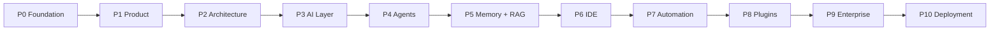

# Roadmap

```
Status: Stable
Priority: High
Owner: Repository Maintainer
Depends On: ENGINEERING_CONSTITUTION.md, MASTER_PRD.md, FEATURE_MATRIX.md, ARCHITECTURE.md
Related Documents: milestones/README.md, DECISIONS.md, VERSIONING.md
Next Expansion: Attach target dates and effort estimates once the team and cadence are set.
Last Updated: 2026-07-23
```

This roadmap sequences Dhee_AI into ten phases and fifty milestones. It is intentionally
dependency-ordered, not date-driven: each phase builds on the previous. Capabilities map to
[`FEATURE_MATRIX.md`](FEATURE_MATRIX.md); detailed milestone specs live in
[`milestones/`](milestones/README.md). Changes to sequencing require updating this file (and an
ADR if the change is architectural).

## Phases



- **Phase 0 — Foundation:** Engineering Constitution, governance, and specifications.
- **Phase 1 — Product:** vision, PRD, feature matrix, success metrics.
- **Phase 2 — Architecture:** architecture, tech stack, monorepo, API/DB/auth foundations.
- **Phase 3 — AI Layer:** provider abstraction, routing, streaming, tools, context, multimodal.
- **Phase 4 — Agent Runtime:** multi-agent orchestration and specialized agents.
- **Phase 5 — Memory & RAG:** multi-scope memory, long-term/semantic memory, RAG, knowledge graph.
- **Phase 6 — IDE:** editor, filesystem, terminal, git, search, AI coding features.
- **Phase 7 — Automation:** workflow engine, jobs, schedules, triggers, pipelines.
- **Phase 8 — Plugin Ecosystem:** plugin/tool/provider SDKs, sandboxing, MCP, marketplace.
- **Phase 9 — Enterprise:** orgs, teams, RBAC, keys, audit, analytics, admin.
- **Phase 10 — Deployment:** Docker, Kubernetes, CI/CD, self-hosted/cloud, auto-updates.

## Milestone map

| Phase | Milestones |
|-------|-----------|
| P0 Foundation | M01 |
| P1 Product | M02 |
| P2 Architecture | M03-M05 |
| P3 AI Layer | M06-M12 |
| P4 Agent Runtime | M13-M18 |
| P5 Memory & RAG | M19-M24 |
| P6 IDE | M25-M32 |
| P7 Automation | M33-M36 |
| P8 Plugin Ecosystem | M37-M41 |
| P9 Enterprise | M42-M46 |
| P10 Deployment | M47-M50 |

## Milestones (titles)
- M01 — Engineering Constitution & Specification Foundation
- M02 — Product Definition & Feature Matrix
- M03 — Architecture Baseline & Monorepo Bootstrap
- M04 — Core Package & Config Foundation
- M05 — API Gateway, Auth & Database Foundation
- M06 — AI Provider SDK & Abstraction
- M07 — Multi-Provider Routing & Failover
- M08 — Streaming Engine
- M09 — Tool-Calling Engine
- M10 — Context Manager & Token Optimizer
- M11 — Structured Output & Embeddings
- M12 — Vision, Voice & Multimodal Inputs
- M13 — Agent Runtime Core
- M14 — Manager & Planner Agents
- M15 — Core Engineering Agents (Backend/Frontend/Database)
- M16 — DevOps, Security & Testing Agents
- M17 — Research, Browser & Computer Agents
- M18 — Custom Agents & Agent SDK
- M19 — Memory Engine Core
- M20 — Multi-Scope Memory
- M21 — Long-Term & Semantic Memory
- M22 — RAG Ingestion & Chunking
- M23 — Retrieval, Reranking & Repository Indexing
- M24 — Knowledge Graph & Memory Privacy Controls
- M25 — Web IDE Shell & Layout
- M26 — Monaco Editor Integration
- M27 — Filesystem Engine & File Explorer
- M28 — Terminal Engine
- M29 — Git Engine & Diff Viewer
- M30 — Project-Wide Search
- M31 — AI Refactoring & Code Review
- M32 — Debugging & Testing Panels
- M33 — Workflow Engine Core
- M34 — Workflow Builder UI
- M35 — Background Jobs & Scheduled Tasks
- M36 — Event Triggers & AI Pipelines
- M37 — Plugin SDK & Lifecycle
- M38 — Tool SDK & Provider SDK
- M39 — Plugin Sandboxing & Permissions
- M40 — MCP Host & Client Compatibility
- M41 — Plugin Marketplace
- M42 — Organizations & Teams
- M43 — RBAC & API Keys
- M44 — Audit Logs & Monitoring
- M45 — Usage Analytics & Billing Hooks
- M46 — Admin Dashboard
- M47 — Docker & Docker Compose Packaging
- M48 — Kubernetes Deployment
- M49 — CI/CD & Release Automation
- M50 — Self-Hosted & Cloud Deployment + Auto-Updates

## Release alignment
Roadmap phases inform SemVer planning in [`VERSIONING.md`](VERSIONING.md). A capability is only
"done" when it satisfies the Definition of Done in
[`ENGINEERING_CONSTITUTION.md`](ENGINEERING_CONSTITUTION.md).
